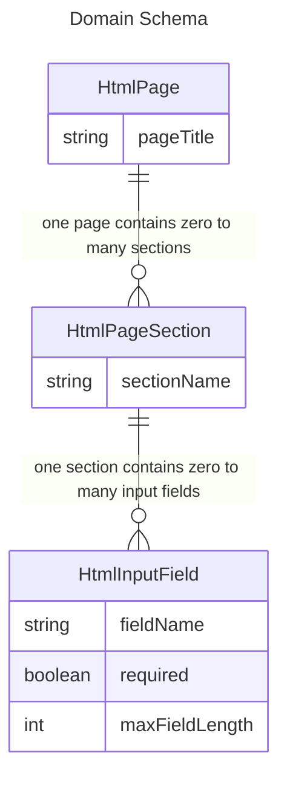

# The HTML forms example project

Let's assume that we want to build the HTML source code for a simple 
HTML GUI to manage person-related information like their names and address 
information or the company they are working for.
We want to generate our HTML source code automatically based on some 
definitions that we store and maintain in an XML file.

## The input for the generated code

In a first step we define the main concepts we need for our simple HTML form application. 
We define the so-called _**concepts**_:

1. _HtmlPage_ concept:
The HTML page shows all information about e.g. a person or a 
company on one page.
 
2. _HtmlPageSection_ concept: 
One page can have multiple sections. Let's assume, on the person page 
you have the section "names" and a second section "address" to group 
the different fields.
 
3. _HtmlInputField_ concept: 
One section can have multiple fields, e.g. the field "firstname", the 
field "lastname". On a second section, you have the information 
like "street", "postalCode", "city", "country"

After having the main concepts defined, we continue to define some 
additional data for each concept, the so-called _**facets**_:
* Each _HtmlPage_ should have a title (_pageTitle_), e.g. "Person" or "Company".
* Same for the _HtmlPageSection_, they also need a name (_sectionName_) like 
"Person names", "Person address", "Company name" or 
"Company address information". 
But this section name is to be defined as optional.
* For each _HtmlInputField_, we can define a field name (_fieldName_) like 
"Firstname", "Lastname" or "Company Name".
* Additionally, for the _HtmlInputField_, we want to define the maximum 
characters that can be typed in (_maxFieldLength_) 
* And we define per _HtmlInputField_ whether you can leave the field blank 
or not (_required_).

This brings us to the following tree of concepts, also called the _**domain schema**_:

The [keywords](glossary.md) we learned in on this page:

* The whole tree of concepts is called the _**DomainSchema**_.

* The DomainSchema contains _**Concepts**_ 
like _HtmlPage_, _HtmlPageSection_, _HtmlInputField_.

* Each Concept can have multiple _**Facets**_ 
like _pageTitle_, _sectionName_, _fieldName_, _required_, _maxFieldLength_.

### The output of the code generation

To work with the given input, we need to fill it into a template text 
and to write the template output to a source file.

The template contains placeholders that will be filled with the definition
data.

### Next steps

To start the tutorial with the installaion, go to [Installation](02-installation.md).
 
